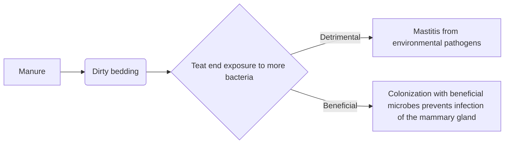

***Caitlin Jeffrey  
Bio 381  
Homework 4***


# First level header

## Second level header

### Third level header

#### Fourth level header

##### Fifth level header

###### Sixth level header


## Unordered lists

* Item 1

* Item 2

  + Item 2a
  + Item 2b

  

## Ordered list

1. Item 1
2. Item 2
3. Item 3
   + Item 3a
   + Item 3b


## Links

http://example.com

[linked phrase](http:example.com)

A [linked phrase][id]. 


## Images


## Block quotes 

> To be or not to be, that is the question. Whether tis nobler... blah blah blah


## Plain code blocks

```
This is a box of literal plain text. Just like I **type it**
```


## R code blocks

```{r}
#here is a comment
x <- 3
y <- "character string"
```


## In-line blocks (fencing)

inline fencing with a backtick `to show anything in plain text with *no* formatting` which can be useful for many things. 


## LaTeX equations

These equations such as $a = 3 + 4$ will appear inside of a single line of text.

These equations such as 
$$
a = 3 + 4
$$
will appear in a separate line of their own. 


## Horizontal line

___


## Tables

| First Header | Second Header    |
| ------------ | ---------------- |
| Content Cell | Content Cell     |
| Content Cell | *formatted text* |


## Highlighted text

==This is highlighted text==




